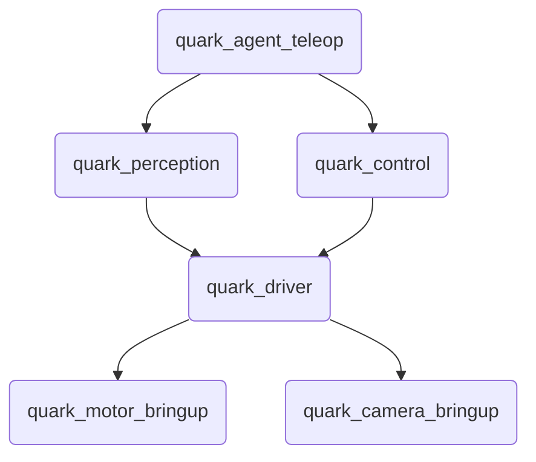

# Code

```mermaid
flowchart TD
    agent_teleop(quark_agent_teleop) --> perception(quark_perception)
    agent_teleop --> control(quark_control)
    perception --> driver(quark_driver)
    control --> driver
    driver --> motor(quark_motor_bringup)
    driver --> camera(quark_camera_bringup)
```
