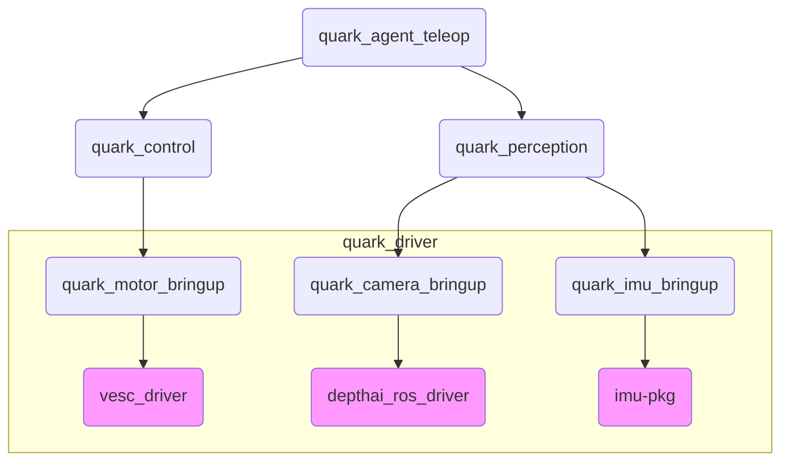

# Code

```mermaid
flowchart TD
    agent_teleop(quark_agent_teleop) --> perception(quark_perception)
    agent_teleop --> control(quark_control)
    perception --> camera
    control --> motor
    perception --> imu
    subgraph quark_driver
        motor(quark_motor_bringup)
        camera(quark_camera_bringup)
        imu(quark_imu_bringup)
        motor --> vesc(vesc_driver)
        camera --> depth_ai(depthai_ros_driver)
        imu --> imu_vendor(imu-pkg)
    end

    classDef extDep fill:#f9f;

    class vesc,depth_ai,imu_vendor extDep;

```
